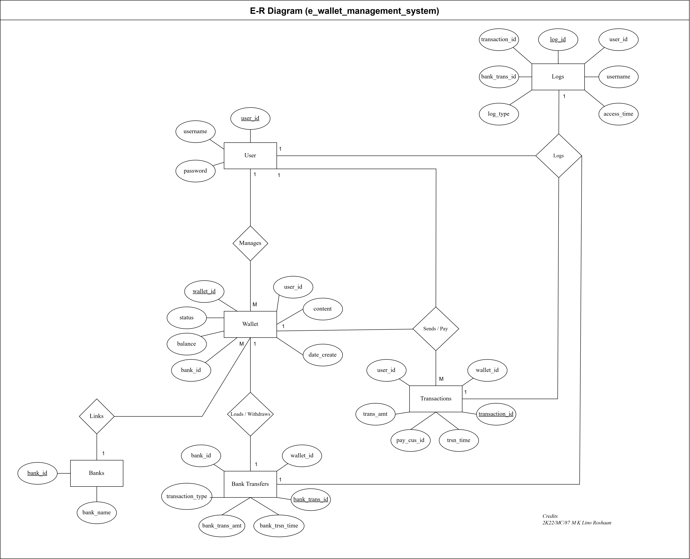

# e_wallet_management_system_v2
Purpose - Database Management System Practical
```
Name -> M K Lino Roshaan
Roll No -> 2K22/MC/87
```

> This is an upgraded version of the project [[e_wallet_management_system](https://github.com/Chronos-Asteri/e_wallet_management_system)]

- More detailed implementation
- Integraded proper database management with normalization
- This project is intended to demonstrate the integration of proper database management into a project
- The previous project [[e_wallet_management_system](https://github.com/Chronos-Asteri/e_wallet_management_system)] was much more focused on the development and pre-development phases of the software development cycle

### Index:
- [Prerequisites](#prerequisites)
- [Local Deployment](#local-deployment)
- [E-R Diagram](#sde-diagrams)
- [Database Relations](#screenshots)
- [Screenshots](#screenshots)


## Prerequisites
1. miniconda - Version 25.1.1 [[Download](https://docs.anaconda.com/miniconda/miniconda-install/)]
2. Python - Version 3.11.11 [[Download](https://www.python.org/downloads/)]

## Local Deployment

1. `conda create --name e_wallet python=3.11`
2. `conda activate e_wallet`
3. `pip install -r requirements.txt`
4. `flask run`

## E-R Diagram



## Database Relations

| | |
|:-------------------------:|:-------------------------:|
| Banks|   Logs|  
| Transactions|  User | 
| Wallet| Bank Transfers|


## Screenshots

| | | |
|:-------------------------:|:-------------------------:|:-------------------------:|
| |   |  |
|  |  ||
|  |  ||